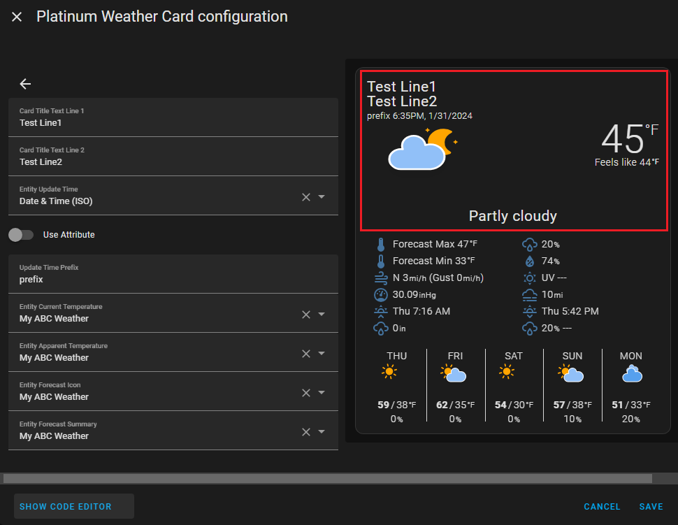
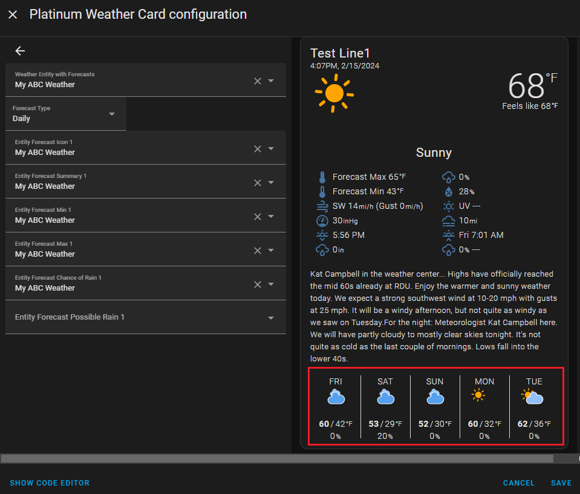

# Platinum Weather Card 

A highly configurable weather card with a graphical configuration.  Based on original Platinum Weather Card by [@makin-things](https://www.github.com/makin-things)

[](https://github.com/custom-components/hacs)
[![GitHub Release][releases-shield]][releases]
[![License][license-shield]](LICENSE.md)


# Need Help?
This is not a supported repo.  This was forked from the original [Platinum Weather Card](https://github.com/Makin-Things/platinum-weather-card/tree/master) with several modifications. The documentation here has also been modified in an attempt to describe the differences or to clarify the original. If you need help with the original Platinum Weather card, the best place to ask is in the Home Assistant Community. There is a thread that can be found [here](https://community.home-assistant.io/t/platinum-weather-card-support/449166).

# Overview

This is a fully customisable weather card with a graphical configuration. The aim is that this card is usable by people everywhere and be able to deal with your sensors no matter what integration(s) provides them. To get the most from the card you may need to look at what various weather integrations provide in addition to the standard weather entity.


The design goals for the card are:

- Totally configurable with a gui editor (no more YAML, although YAML is still supported)
- A ridiculous amount of flexibilty, as we can not possibbly guess everyone's use case

# Installation

The original Platinum Weather Card supports installation using HACS. It actually discourages manual installation "Due to the complexities of the card (icons/split code for performance)". The original card also exists within the HACS Store making its installation even more convenient.  </br>

This "forked version" can also use HACS, but one needs to configure HACS for this particular forked repository. 
- Go to the HACS "Front End" page and click on the upper-right 3-dots, and then click on "Custom Repositories". For "Repository", paste ```https://github.com/tommyjlong/platinum-weather-card ```, and choose `Lovelace` for the Category.  Hit ADD.
- Back in the HACS "Front End" page, click on "+ EXPLORE AND DOWNLOAD REPOSITORIES".  Then do a search for "Platinum Weather Card".  
- :warning: THERE WILL BE TWO IDENTICAL Platinum Weather Card ENTRIES showing up.  The top one is the original version that comes in the HACS store, the one below it is this "forked version". Click on the below entry.
- A page should appear showing the README and the author showing up in the upper left hand corner (make sure it shows `tommyjlong` otherwise this is the incorrect repository).  On this page it should allow you to DOWNLOAD this card.  

After installing the card you can add as many instances of the card on the dashboard as you desire. 
# Getting Started

You MUST have already configured a weather integration to provide data for the card to use. As with all cards they only visualise data from backend entities. There are numerous weather integrations available in both the core and HACS. You will need to find one that is best suited to your location (some countries have multiple options with varying degrees of accuracy). In this "forked version", for forecasts data, the card currently only supports the configuration of one weather integration. It is possible to use additional weather integrations for forecasts but to do so will require the use of template sensors to extract what you need.  

When you first create a card it will show nothing until you go and select the entities you want to use in the GUI config, so a card that looks like this is not an error, but just needs configuring.


Most of the configuration should be reasonably obvious, but the following sections give more details. It is recommended that you at least have a read of both the 'Concepts' and 'Sections'. After that it is more of a reference for the various parts of the card if you need more information.

# Concepts

The card has sections, any of these sections can be enabled/disabled and reordered to suit your individual needs. Each section has its own configuration pages for the selection of entities and to control display and styling.


It is understood that everyone's use case may be different (and you may have limited data depending on the weather integration you are using), the default settings are aimed at maintaining compatibiltiy with the old bom/custom/darksky weather card that we are aiming to deprecate.
There is no reason that all of your weather data needs to be shown on a single card. This card allows you to have multiple instances with different configurations to achieve what you want.

Rather than putting everything in one gigantic card it is possible to create a few smaller cards, with each having a lot of options of disabled. For example, you could choose to put observations on one card and forecast information on another.

# Sections

As mentioned above, this new card allows you to enable/disable/reorder the sections. These are the sections currently available:
* Overview
* Extended
* Slots
* Daily Forecasts

On the cards main configuration dialog, use the switch to completely remove a section if it is not required. This will result in that section taking up absolutely no space on the card. Use the up/down buttons to reorder the sections as desired. The Global Options contains settings that have an effect on multiple sections.

## Overview Section

This section as the name suggests, adds an overview section to the card.



There are 4 different layout options to choose from for the overview section. There are 'complete', 'observations', 'forecast' and 'title only'.

<caption><b>Complete</b></caption>


<caption><b>Observations</b></caption>


<caption><b>Forecast</b></caption>


<caption><b>Title Only</b></caption>


The fields available to fill in will be altered based on the layout chosen.

| Option name                           | Type    | Description                                                                                                                                                     |
| ------------------------------------- | ------- | --------------------------------------------------------------------------------------------------------------------------------------------------------------- |
| Card Title Text Line 1                | String  | Optional text that should be displayed as the cards title                                                                                                       |
| Card Title Text Line 2                | String  | Optional text that should be displayed as the cards title                                                                                                       |
| Entity Update Time                    | Entity  | Optionally defines the entity to use for the timestamp. The entities state MUST provide a valid timestamp in RFC 3339 format (ie. `yyyy-mm-ddThh:mm:ss+offset`) |
| &nbsp;&nbsp;&nbsp;&nbsp;Use Attribute | Boolean | If this is enabled you will then be able to choose an attribute of the above entity to use for the timestamp                                                    |
| &nbsp;&nbsp;&nbsp;&nbsp;Attribute     | String  | The attribute that contains the timestamp                                                                                                                       |
| Update Time Prefix                    | String  | Optional text to include as a prefix to the timestamp                                                                                                           |
| Entity Current Temperature            | Entity  | The entity that contains the current temperature                                                                                                                |
| Entity Apparent Temperature           | Entity  | An optional entity that contains the apparent 'feels like' temperature                                                                                          |
| Entity Forecast Icon                  | Entity  | The entity whose state contains the current conditions.  It is used to derive the name of the icon to display. _This use to be Entity Current Conditions_                |
| Entity Forecast Summary               | Entity  | The entity whose state contains the current condition. It is converted to a prettier state name. (Ex. partlycloudy to Partly cloudy).  _This use to be Entity Current Text_ |

The various entity fields can either be a sensor that provides the value in its state, or in the case where the weather integration is being used, you can just select that weather entity and a corresponding attribute will be selected automatically.

## Extended Section

A section that shows today's detailed forecast (See the figure below with the highlighted red box). To use this section you will need either a weather integration or a sensor that provides a more detailed text about today's weather forecast (Note: not all weather integrations or weather systems support this). 
* If it is available with your weather entity, then in this "forked version" of the card, configure the "Entity Extended Forecast" along with the "Extended Use Attribute" set to ON (`true` in YAML) and set the "Extended Name Attribute" to the name of the weather entity's attribute.
* For a sensor, configure the "Entity Extended Forecast" and the state will be used as text, or optionally in addition, set the "Extended Use Attribute" to ON (`true` in YAML) and set the "Extended Name Attribute" to the name of the sensor entity's attribute.
* If it is not available for your weather integration the best thing to do is to disable the extended section.


The following fields are available.

| Option name                           | Type    | Description                                                                                                          |
| ------------------------------------- | ------- | -------------------------------------------------------------------------------------------------------------------- |
| Entity Extended Forecast              | Entity  | The name of the entity that contains the detailed forecast                                                           |
| &nbsp;&nbsp;&nbsp;&nbsp;Use Attribute | Boolean | If this is enabled you will then be able to choose an attribute of the above entity to use for the detailed forecast.  In this "forked version", if a weather entity is used for the Entity Extended Forecast, then this must be set to ON/true and the Attribute must also be configured. |
| &nbsp;&nbsp;&nbsp;&nbsp;Attribute     | String  | The attribute that contains the detailed forecast. In this "forked version" if the Entity Extended Forecast is a weather entity, there is a bug in that the choices listed are not forecast attributes, however you can still configure the attribute directly (ex. `detailed_description`). |
| Entity Today's UV Forecast            | String  | If defined the text from this entity will be appended to the detailed forecast                                       |
| Entity Today's Fire Danger            | String  | If defined the text from this entity will be appended to the detailed forecast                                       |

## Slots Section

A section to show a set of data in 2 columns (with up to 8 rows). This section is highly configurable. As you select different options for the slots the set of entities that are needed gets dynamically updated to indicate what options should be set.


The following table describes what each slot value is intended to show. Note that what is available is very dependant on the weather integration in use.

| Slot Value                   | Description                                                                                           | Display Sample           |
| ---------------------------- | ----------------------------------------------------------------------------------------------------- | ------------------------ |
| Current humidity             | Shows the current humidity as a percentage                                                            | 36%                      |
| Today's recorded rainfall    | The amount of rain that has fallen today                                                              | 5mm                      |
| Current air pressure         | The current atmopheric air pressure                                                                   | 1018hPa                  |
| Current wind conditions      | The current direction, speed and gust speed. If any element is missing it is removed from the display | SSE 9km/h (Gust 13km/h)  |
| Current wind conditions kts  | The current direction, speed and gust speed. If any element is missing it is removed from the display | SSE 5Kt (Gust 6Kt)       |
| Current visibility           | The current visibility. Most likely only available for airports                                       | 70km                     |
| Today's observed Max         | The maximum temperature recorded so far today                                                         | Observed Max 19°C        |
| Today's observed Min         | The minimum temperature recorded so far today                                                         | Observed Min 4°C         |
| Today's forecast Max         | The maximum temperature recorded so far today                                                         | Observed Max 19°C        |
| Today's forecast Min         | The minimum temperature recorded so far today                                                         | Observed Min 4°C         |
| Next temp min/max            | The next chronologically occuring minimum or maximum                                                  | Overnight Min 4°C        |
| Following temp min/max       | The following chronologically occuring minimum or maximum                                             | Tomorrow's Max 20°C      |
| Observed/forecast max        | Todays observer maximum and forecast maximums                                                         | Obs Max 19°C (Fore 19°C) |
| Observed/forecast min        | Todays observer maximum and forecast minimums                                                         | Obs Min 4°C (Fore 5°C)   |
| Next sun rise/set time       | The time of the next chronologically occuring sunrise or sunset                                       | 7:10pm                   |
| Following sun rise/set time  | The time of the following chronologically occuring sunrise or sunset                                  | Mon 6:35am               |
| Chance of rain               | The percentage chance of rain for today                                                               | 10%                      |
| Rainfall forecast            | A comination of the percentage chance of rain and the estimated amount                                | 10% - 3 to 6mm           |
| Today's forecast rainfall    | The estimated amount of rain today                                                                    | Forecast 3 to 6mm        |
| Tomorrow's forecast rainfall | The estimated amount of rain tomorrow                                                                 | Fore Tom 1 to 3mm        |
| Today's uv forecast          | The forecast maximum uv level for today                                                               | UV Extreme               |
| Today's fire danger          | The forecast fire danger for today                                                                    | Moderate                 |
| Custom entity 1              | Create a custom entity by specifying an icon, entity and unit                                         |                          |
| Custom entity 2              | Create a custom entity by specifying an icon, entity and unit                                         |                          |
| Custom entity 3              | Create a custom entity by specifying an icon, entity and unit                                         |                          |
| Custom entity 4              | Create a custom entity by specifying an icon, entity and unit                                         |                          |
| Blank slot                   | Show an empty slot                                                                                    |                          |
| Remove slot                  | Remove the slot. Any slot below will move up                                                          |                          |

## Daily Forecast Section

A section to show the daily forecast for a specified number of days in either a horizontal or vertical layout.



There are two posible layouts.  These are configured in the Card Editor for the Daily Section "Options".

**Horizontal** </br>
This is the default.

</br>
  There are two configuration options available for showing the Maximum and Minimum Temperatures:
  * `old_daily_format` (YAML mode only)
      * `true` will show "Maximum Temperature" on one line and underneath it the "Minimum Temperature on a second line, one over the top of the other.
      * `false` (default) will show "Minimum temperature" and "Maximum Temperature" on one line separated by "/".
  * `tempformat` (YAML mode only)
      * `highlow` - When old_daily_format is set to false, will show the Maximum Temperature first, and then Minimum Temperature.  This will be useful for forecasts have that day's mimimum lows actually occurring after midnight the following day.
      * _otherwise_ (default) When old_daily_format is set to false, will show the Minimum Temperature first and then Maximum Temperature.  This will be useful for forecasts that have that day's minimum low occuring on the same day.</br>

**Vertical**</br>


The following fields are available.

| Option name                               | Type    | Description                                                                                                          |
| ----------------------------------------- | ------- | -------------------------------------------------------------------------------------------------------------------- |
| Weather Entity with Forecasts             | String  | In this "forked version", if a weather entity is configured anywhere to provide forecast data for this card, only a single weather entity is supported and it must be configured here. Any other configuration(s) below using a weather entity must set the configured weather entity to be the same as this one.    |
| Forecast Type                             | String  | In this "forked version", if a weather entity is used to provide forecast data, the forecast type must be configured and set to "daily".  _Options for "Hourly" and "Twice Daily" are listed but are NOT._   |
| Entity Forecast Icon 1                    | String  | The sensor entity whose state, or the weather entity whose forecast attribute `condition` contains the forecasted condition. It is used to derive the name of the icon to display.        |
| Entity Forecast Summary 1                 | String  | The sensor entity whose state provides the short summary text (ex. "Showers increasing."). In this "forked version", a weather entity can be also be used and its forecast attribute `condition` will be used for the summary text and it is converted to a prettier state name. (Ex. partlycloudy to Partly cloudy).                                                                      |
| Entity Forecast Min 1                     | String  | The entity that provides the forecast minimum temperature                                                            |
| Entity Forecast Max 1                     | String  | The entity that provides the forecast maximum temperature                                                            |
| Entity Forecast Chance of Rain 1          | String  | The entity that provides the percentage chance of rain                                                               |
| Entity Forecast Possible Rain 1           | String  | The entity that provides the estimated amount of rain                                                                |
| Entity Extended Forecast 1                | String  | The name of the entity that contains the detailed forecast text.  In this "forked version" if a weather entity is used, an attribute has to be specified.    |
| &nbsp;&nbsp;&nbsp;&nbsp;Use Attribute     | Boolean | If this is enabled you will then be able to choose an attribute of the above entity to use for the detailed forecast.  In this "forked version", if a weather entity is used for the Entity Extended Forecast 1, then this must be set to ON/true and the Attribute must also be configured. |
| &nbsp;&nbsp;&nbsp;&nbsp;Attribute         | String  | The attribute that contains the detailed forecast text.  In this "forked version" for a weather entity, there is a bug in that the choices listed are not forecast attributes, however you can still configure the attribute directly (ex. `detailed_description`). |
| Entity Fire Danger 1                      | String  | The entity that provides the fire danger forecast                                                                    |

For these entities you can either specify a weather entity, in which case this card will use the data from the forecast's attributes (note that "detailed forecast text" and "fire danger" may not be included in your weather integration's forecast), or you can use individual template sensors and when you provide the name of the sensor for tomorrow's forecast item use a number in the name and then repeat this for the subsequent days' sensors and make sure these corresponding subsequent days' sensors have an incrementing number in their name.


## Global options

This page contains options that don't neatly fit in other places (ie. they have an effect on multiple sections).


The following fields are available.

| Option name      | Type    | Description                                                                        |
| ---------------- | ------- | ---------------------------------------------------------------------------------- |
| Show staic icons | Boolean | Turning this on disables the use of animated icons across the entire card          |
| Time format      | String  | Selects whether to use the system time format or explicitly set 12 or 24 hour mode |
| Locale           | String  | Specifies a locale to pass into any conversion functions                           |


# YAML Reference

This reference is here for completeness and can be configured in the card's editor while in "SHOW CODE EDITOR" mode. Almost all settings can be configured using the GUI so in general, you should not need to refer to this. The options are split into global settings and a section for each of the sections in the card.

## Global Settings

| Variable                    | Type    | Default                                                         | Description                                                         |
| --------------------------- | ------- | --------------------------------------------------------------- | ------------------------------------------------------------------- |
| type                        | String  | null                                                            | Must be `custom:platinum-weather-card`                              |
| section_order               | List    | `- overview`<br>`- extended`<br>`- slots`<br>`- daily_forecast` | Specifies the order in which the sections are displayed on the card |
| show_section_overview       | Boolean | `true`                                                          | Specifies if the overview section is visible                        |
| show_section_extended       | Boolean | `true`                                                          | Specifies if the extended section is visible                        |
| show_section_slots          | Boolean | `true`                                                          | Specifies if the slots section is visible                           |
| show_section_daily_forecast | Boolean | `true`                                                          | Specifies if the daily_forecast section is visible                  |
| tap_action                  | Action  | none                                                            | Specifies what action to perform when the card is tapped            |
| hold_action                 | Action  | none                                                            | Specifies what action to perform when the card is held              |
| double_tap_action           | Action  | none                                                            | Specifies what action to perform when the card is double tapped     |
| option_static_icons         | Boolean | false                                                           | Set to true to use non-animated icons                               |
| option_time_format          | String  | `system`                                                        | Can be one of `system`, `12hour` or `24hour`                        |
| option_locale               | String  | none                                                            | The locale to use when formatting timestamps                        |
| text_update_time_prefix     | String  | none                                                            | Specifies a string to prepend to the update time                    |

## Actions
This "forked version" tweaked the original somewhat.  All the [Actions](https://www.home-assistant.io/dashboards/actions/) that are documented in Home Assistant may or may not be supported.
Here are some examples showing how "Actions" can be used.</br>

**Tap Action**</br>
In this example the action `more-info` is used to pop up a targetted entity's "more info" card.  The targetted entity has to be specified further as either `entity` or `camera_image` (You can use both but `entity` will take precedence).
```
tap_action:
  action: more-info

camera_image: camera.back_yard_camera
entity: weather.my_abc_weather
```
**Hold Action**</br>
In this example, a hold action will navigate the user to lovelace view (a UI tab) named "MISC".
```
hold_action:
  action: navigate
  navigation_path: /lovelace/misc
```
**Double Tap Action**</br>
In this example, a double-tap action will toggle on/off a specified light.
```
double_tap_action:
  action: call-service
  service: light.toggle
  data: {}
  target:
    entity_id: light.test_product
```

## Overview Settings

| Variable                       | Type    | Default    | Description                                                                                                             |
| ------------------------------ | ------- | ---------- | ----------------------------------------------------------------------------------------------------------------------- |
| overview_layout                | String  | `complete` | Can be one of `complete`, `observations`, `forecast` or `title only`. Sets the layout to use for the overview section   |
| option_show_overview_decimals  | Boolean | `false`    | Show one decimal place on current and apparent temperature                                                              |
| option_show_overview_separator | Boolean | `false`    | Show separator at bottom of overview section                                                                            |
| text_card_title                | String  | none       | Line 1 of the cards title                                                                                               |
| text_card_title_2              | String  | none       | Line 2 of the cards title                                                                                               |
| entity_update_time             | String  | none       | The name of the entity that provides the update time. It uses the entity's state unless ``update_time_use_attr` is true |
| update_time_use_attr           | Boolean | `false`    | The name of the attribute that provides the update time                                                                 |
| update_time_name_attr          | String  | none       | The name of the attribute to use for the update time                                                                    |
| entity_temperature             | String  | none       | The name of the entity that provides the current temperature                                                            |
| entity_apparent_temp           | String  | none       | The name of the entity that provides the apparent (feels like) temperature                                              |
| entity_forecast_icon           | String  | none       | The name of the entity that provides todays forecast icon                                                               |
| entity_summary                 | String  | none       | The name of the entity that provides the short forecast summary                                                         |

## Extended Section

| Variable                  | Type    | Default | Description                                                                                 |
| ------------------------- | ------- | ------- | ------------------------------------------------------------------------------------------- |
| entity_extended           | String  | none    | The name of the entity that provides today's extended forecast                              |
| extended_use_attr         | Boolean | `false` | The name of the attribute that provides the extended forecast                               |
| extended_name_attr        | String  | none    | The name of the attribute to use for the extended forecast                                  |
| entity_todays_uv_forecast | String  | none    | The name of the entity that provides today's uv forecast to append to the extended forecast |
| entity_todays_fire_danger | String  | none    | The name of the entity that provides today's fire danger to append to the extended forecast |

## Slots Section

| Variable                          | Type    | Default         | Description                                                      |
| --------------------------------- | ------- | --------------- | ---------------------------------------------------------------- |
| slot_l1                           | Slot    | `forecast_max`  | The value to show in slot l1. See table below for more detail    |
| slot_l2                           | Slot    | `forecast_min`  | The value to show in slot l2. See table below for more detail    |
| slot_l3                           | Slot    | `wind`          | The value to show in slot l3. See table below for more detail    |
| slot_l4                           | Slot    | `pressure`      | The value to show in slot l4. See table below for more detail    |
| slot_l5                           | Slot    | `sun_next`      | The value to show in slot l5. See table below for more detail    |
| slot_l6                           | Slot    | `remove`        | The value to show in slot l6. See table below for more detail    |
| slot_l7                           | Slot    | `remove`        | The value to show in slot l7. See table below for more detail    |
| slot_l8                           | Slot    | `remove`        | The value to show in slot l8. See table below for more detail    |
| slot_r1                           | Slot    | `popforecast`   | The value to show in slot r1. See table below for more detail    |
| slot_r2                           | Slot    | `humidity`      | The value to show in slot r2. See table below for more detail    |
| slot_r3                           | Slot    | `uv_summary`    | The value to show in slot r3. See table below for more detail    |
| slot_r4                           | Slot    | `fire_danger`   | The value to show in slot r4. See table below for more detail    |
| slot_r5                           | Slot    | `sun_following` | The value to show in slot r5. See table below for more detail    |
| slot_r6                           | Slot    | `remove`        | The value to show in slot r6. See table below for more detail    |
| slot_r7                           | Slot    | `remove`        | The value to show in slot r7. See table below for more detail    |
| slot_r8                           | Slot    | `remove`        | The value to show in slot r8. See table below for more detail    |
| entity_pop                        | String  | none            | Entity required for `pop` and `popforecast`                      |
| entity_pos                        | String  | none            | Entity required for `popforecast` and `possible_today`           |
| entity_possible_tomorrow          | String  | none            | Entity required for `possible_tomorrow`                          |
| entity_rainfall                   | String  | none            | Entity required for `rainfall`                                   |
| entity_humidity                   | String  | none            | Entity required for `humidity`                                   |
| entity_pressure                   | String  | none            | Entity required for `pressure`                                   |
| pressure_units                    | String  | none            | Optional string for current pressure units                       |
| entity_observed_max               | String  | none            | Entity required for `observed_max` and `temp_maximums`           |
| entity_observed_min               | String  | none            | Entity required for `observed_min` and `temp_minimums`           |
| entity_forecast_max               | String  | none            | Entity required for `forecast_max` and `temp_maximums`           |
| entity_forecast_min               | String  | none            | Entity required for `forecast_min` and `temp_minimums`           |
| entity_temp_next                  | String  | none            | Entity required for `temp_next`                                  |
| entity_temp_next_label            | String  | none            | Entity required for `temp_next`                                  |
| entity_temp_following             | String  | none            | Entity required for `temp_following`                             |
| entity_temp_following_label       | String  | none            | Entity required for `temp_following`                             |
| entity_uv_alert_summary           | String  | none            | Entity required for `uv_summary`                                 |
| entity_fire_danger                | String  | none            | Entity required for `fire_danger`                                |
| entity_wind_bearing               | String  | none            | Entity required for `wind` and `wind_kt`                         |
| entity_wind_speed                 | String  | none            | Entity required for `wind`                                       |
| entity_wind_gust                  | String  | none            | Entity required for `wind`                                       |
| entity_wind_gust_kt               | String  | none            | Entity required for `wind_kt`                                    |
| entity_wind_speed_kt              | String  | none            | Entity required for `wind_kt`                                    |
| entity_visibility                 | String  | none            | Entity required for `visibility`                                 |
| entity_sun                        | String  | none            | Entity required for `sun_next` and `sun_following`               |
| custom1_value                     | String  | none            | Entity required for `custom1`                                    |
| custom1_icon                      | Icon    | none            | Name of mdi icon to use for `custom1`                            |
| custom1_units                     | String  | none            | Units to display for `custom1`                                   |
| custom2_value                     | String  | none            | Entity required for `custom2`                                    |
| custom2_icon                      | Icon    | none            | Name of mdi icon to use for `custom2`                            |
| custom2_units                     | String  | none            | Units to display for `custom2`                                   |
| custom3_value                     | String  | none            | Entity required for `custom3`                                    |
| custom3_icon                      | Icon    | none            | Name of mdi icon to use for `custom3`                            |
| custom3_units                     | String  | none            | Units to display for `custom3`                                   |
| custom4_value                     | String  | none            | Entity required for `custom4`                                    |
| custom4_icon                      | Icon    | none            | Name of mdi icon to use for `custom4`                            |
| custom4_units                     | String  | none            | Units to display for `custom4`                                   |
| option_today_temperature_decimals | Boolean | `false`         | Show one decimal place for temperature slots                     |
| option_today_rainfall_decimals    | Boolean | `false`         | Show one decimal place for rainfall slots                        |
| option_pressure_decimals          | Number  | `0`             | Number of decimals to show for air pressure `0`, `1`, `2` or `3` |
| option_color_fire_danger          | Boolean | `true`          | Use color attributes from fire danger if set                     |

| Slot              | Description                                                            |
| ----------------- | ---------------------------------------------------------------------- |
| pop               | Possibility of precipitation (eg. 10%)                                 |
| popforecast       | Rainfall forecast (eg. 10% - 15-25mm)                                  |
| possible_today    | Possible rain today (eg. Forecast 15-25mm)                             |
| possible_tomorrow | Possible rain tomorrow (eg. Fore Tom 5-10mm)                           |
| rainfall          | Actual rainfall today (eg. 0mm)                                        |
| humidity          | Current humidity (eg. 67%)                                             |
| pressure          | Current pressure (eg. 1018hPa)                                         |
| observed_max      | Todays observed maximum (eg. Observed Max 14°C)                        |
| observed_min      | Todays observed minimum (eg.Observed Min 3°C)                          |
| forecast_max      | Todays forecast maximum (eg. Forecast Max 19°C)                        |
| forecast_min      | Todays forecast minimum (eg. Forecast Min 1°C)                         |
| temp_next         | The next min or max (eg. Max 19°C)                                     |
| temp_following    | The following min or max (eg. Overnight Min 4°C)                       |
| temp_maximums     | Both the observed and forecast maximums (eg. Obs Max 15°C (Fore 19°C)) |
| temp_minimums     | Both the observed and forecast minimums (eg. Obs Min 13°C (Fore 1°C))  |
| uv_summary        | UV forecast (eg. UV High)                                              |
| fire_danger       | Fire Danger (eg. CATASTROPHIC)                                         |
| wind              | Current wind conditions (eg. W 7 km/h (Gust 11km/h))                   |
| wind_kt           | Current wind conditions (eg. W 4 Kt (Gust 6Kt))                        |
| visibility        | Visibility forecast (eg. 24.1km)                                       |
| sun_next          | The next sunrise or sunset (eg. Mon 06:38)                             |
| sun_following     | The following sunrise or sunset (eg. 19:07)                            |
| custom1           | Use custom 1 fields to select behaviour                                |
| custom2           | Use custom 2 fields to select behaviour                                |
| custom3           | Use custom 3 fields to select behaviour                                |
| custom4           | Use custom 4 fields to select behaviour                                |
| empty             | Leave the slot empty, but don't remove the space                       |
| remove            | Remove the slot entirely                                               |

## Daily Forecast Section

| Variable                       | Type    | Default      | Description                                                                |
| ------------------------------ | ------- | ------------ | -------------------------------------------------------------------------- |
| weather_entity                 | String  |              | The main weather entity for all weather entity related forecasts           |
| forecast_type                  | String  | `daily`      | When using the main weather entity, this specifies the forecast type.  Only "Daily" is supported. _In the future, options for "Hourly" and "Twice Daily" may be supported._  |
| daily_forecast_layout          | String  | `horizontal` | Format for layout `horizontal` or `vertical`                               |
| daily_forecast_days            | Number  | `5`          | Number of days to include in forecast. `horizontal (1-5)` `vertical (1-7)` |
| option_tooltips                | Boolean | `false`      | Show forecast tooltips on horizontal forecast                              |
| daily_extended_forecast_days   | Number  | `7`          | Show extended forecast. (only for vertical forecast `(1-7)`)               |
| option_daily_color_fire_danger | Boolean | `true`       | Use color attributes from fire danger if set (oly for vertical forecast)   |
| old_daily_format               | Boolean | `false`      | If set to true, will show High Temps over the top of Low Temps             |
| tempformat                     | String  |              | If set to `highlow` then High temps are shown first followed by Low temps  |

# History
This "forked version" of the Platinum Weather Card's main modification is to support Home Assistant's new [2023.9](https://www.home-assistant.io/blog/2023/09/06/release-20239/#weather-forecast-service) method for obtaining Weather Forecasts as this is not supported in the original. This new method requires the front-end to subscribe to weather forecast events with the weather integration. The data received is the same data that can be found using the new service `weather.get_forecasts`.

The original Platinum Weather Card has been patterned after the original Dark-Sky animated weather card (https://github.com/iammexx/home-assistant-config/tree/master/ui/darksky), and a forked variant, the BOM Weather Card (https://github.com/DavidFW1960/bom-weather-card). One of its original design goals was to rovide an upgrade path from @DavidFW1960 custom-weather-card (we are working very closely to ensure this works). There has been a lot of code reused, but this card has effectively been rewritten from the ground up to make it more flexible.
## Migration from the old card

Migration from the older [Custom Animated Weather Card](https://github.com/DavidFW1960/bom-weather-card) is straight forward. It is recommended that you create a new card rather so that your current cards config is preserved until you are happy with the new cards configuration.

Create a new Platinum Weather Card, switch to the Code Editor (YAML mode) and simply paste in the contents of your existing configuration, making sure to keep the new `type: custom:platinum-weather-card`. At this stage some elements may not appear correctly. Save the card and then edit it again (the editor updates the configuration when opened if it detects an older config and performs some update tasks) and then save it once more.

If there are still items that don't look correct you will need to manually adjust those to suit.

[license-shield]: https://img.shields.io/github/license/makin-things/platinum-weather-card.svg?style=for-the-badge
[releases-shield]: https://img.shields.io/github/release/tommyjlong/platinum-weather-card.svg?style=for-the-badge
[releases]: https://github.com/tommyjlong/platinum-weather-card/releases
